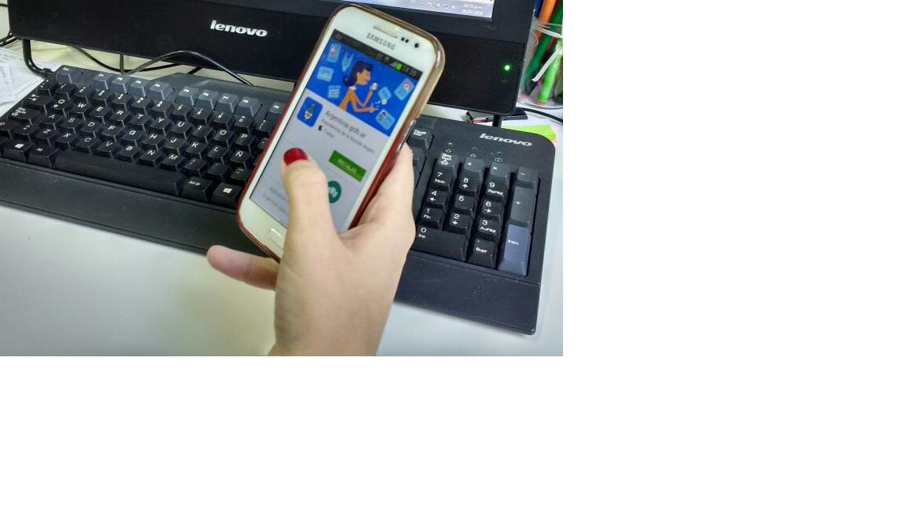
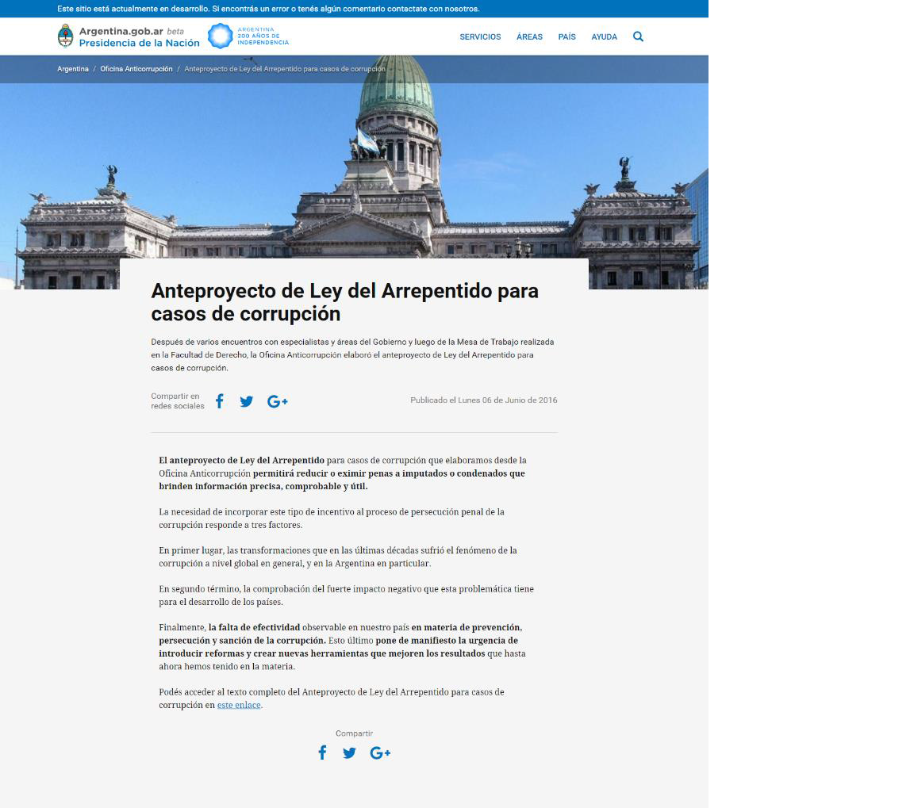
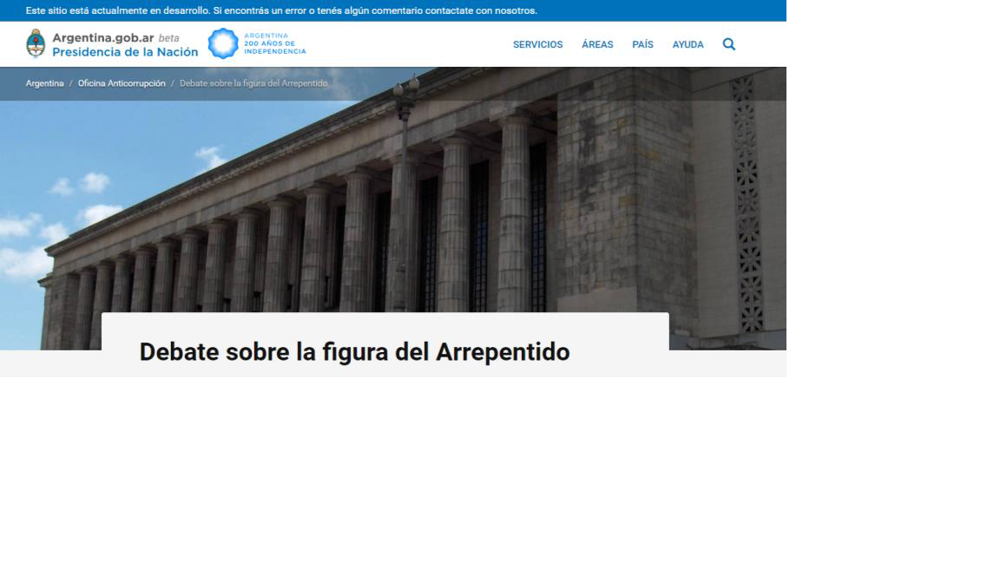
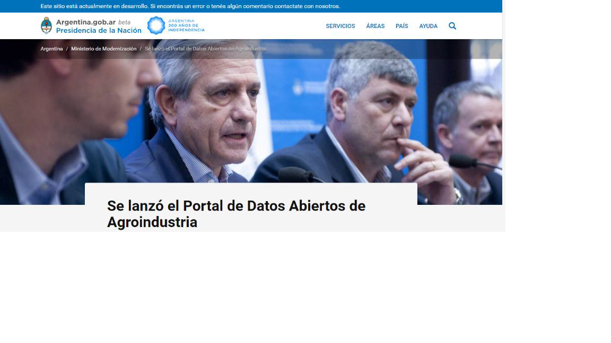

# Guía de producción de contenidos web para Argentina.gob.ar

**Descripción**: este apunte señala cuestiones centrales a tener en cuenta al momento de producir contenido para la web Argentina.gob.ar. Incluye aspectos de estrategia, datos técnicos sobre la plataforma y tips para lograr una comunicación simple y efectiva.

Esta guía pensada para Argentina.gob.ar se apoya en la [Guía de estilo para contenidos web](https://github.com/argob/estandares/blob/master/contenido-web.md)

## Cómo comunicar desde Argentina.gob.ar

[Argentina.gob.ar](https://www.argentina.gob.ar/) es el sitio web oficial del Estado argentino y, como tal, es el espacio de comunicación de los servicios al ciudadano.

El ciudadano ingresa a un sitio del gobierno para buscar información, recibir un beneficio, acceder a un derecho, cumplir con una obligación o tomar decisiones.

Nuestro objetivo, sobre la base de esa premisa, es que el ciudadano encuentre todo en un solo lugar, que pueda hacer consultas sobre [trámites, servicios y beneficios](https://www.argentina.gob.ar/buscar/%2A?f%5B0%5D=bundle%3A%28tramite%20OR%20argentinagobar_migtram%29) de la Administración Pública Nacional. Para eso le presentamos un instructivo de cómo hacerlo, qué documentación necesita, cuánto tiempo requiere y cuánto cuesta.

También podrá sacar turnos en línea, descargar formularios o documentación necesaria para iniciar los trámites y así ganar tiempo.

**Creemos que un sitio funciona solo si la gente puede encontrar lo que necesita rápidamente y se retira sin tener que pensar demasiado en eso, con una sensación de comodidad y no de frustración.**

Para comunicar en un sitio web de gobierno es fundamental pensar que el usuario es el ciudadano. Según Google en Argentina, en 2015 **29 millones de personas** estaban conectadas a la Red, lo que representa el 72% de la población.

Por otra parte, es importante tener en cuenta que, en términos generales, **se lee poco más del 20% del texto de una página web** y **13 millones de personas usa celulares** para interactuar con Internet.

Cada vez que se genera un contenido hay que pensar que el ciudadano entra porque necesita algo. Entender esa necesidad nos obliga a ser:
* Informativos y concisos.
* Claros y directos.

## ¿Qué tipo de contenidos puedo publicar?

Es importante que el enfoque de toda la información a publicar sea de servicio al ciudadano.

**Sobre el organismo**
* Misión, objetivos, autoridades, contactos.
* Políticas, programas, proyectos.
* Resultados e informes.

**Información**

* Sobre servicios, beneficios o regulaciones documentos. 
* Respuestas a preguntas frecuentes.

**Noticias y novedades**
* Es un sitio de servicios al ciudadano, publica lo que el ciudadano necesita saber para que pueda cumplir su objetivo. 
* No publiques todo lo que sea posible.

**Anuncios y campañas de difusión**

* Inscripciones a cursos, concursos, jornadas.
* Campañas de concientización. Inicio de programas destinados a un público en particular.

## Pautas de escritura

**La construcción del mensaje**

 Reconocer las necesidades del usuario nos ayuda a que el mensaje sea más efectivo. Si se trata de un programa o un servicio se recomienda:

1. Definir objetivos que te gustaría que el usuario cumpla en la web.
2. Formular un problema y proponer la solución, ayuda a la incorporación de la información sea más sencilla.

Tomando como referencia casos exitosos de gobierno digital y comunicación web, se mencionan los resultados del trabajo realizado para el desarrollo del sitio del [Reino Unido](https://www.gov.uk/). 

Según se explica en la guía de producción de contenido del sitio, se realizaron **pruebas de usabilidad para evaluar** si un estilo de presentación de la información genera **mejoras para el usuario**:

1. Los textos con un estilo promocional: 0 %

2. Los textos concisos, con economía de palabras: 58 %

3. Un diseño que facilite el reconocimiento: 47 %
4. Un lenguaje informativo, neutral: 27 %   

     
    Si combinamos todas las mejoras y elaboramos un contenido 
    conciso y de fácil lectura, optimiza en un 124 % sus posibilidades.

Un buen contenido es fácil de leer y de comprender, por eso se recomienda utilizar un lenguaje simple y claro. Requiere una forma de expresión sencilla.

El registro es el de una conversación habitual y coloquial. No hay excusas para utilizar vocabulario complejo o información que no aporte nada.

  

**La composición de las frases**

1. Claridad desde la gramática y la semántica, utilizando palabras cortas, conocidas y precisas.

2. Deben ser cortas. Sin exceso de incisos ni de circunstancias.

3. El núcleo de cada frase, el verbo, debe ser fuerte y directo, aclaró, y no débil y sinuoso, hizo la aclaración.

4. En textos largos el ritmo sugerido es de frase larga + frase corta + frase larga, resulta ideal para conformar un párrafo eficaz e impactante.

5. Adverbios y adjetivos se recomienda que sean descriptivos.

**Visualización de la información**

Si tenemos en cuenta que se lee el **20%** del total del contenido, podemos diferenciar tres formas para describir el modo en que recorremos los contenidos de una web, identificables con tres letras de nuestro alfabeto: F, E y L.

Es importante incorporar elementos que nos permitan destacar información y mejorar su visualización:
1. Listas numeradas, viñetas, énfasis en palabras u oraciones claves, resumen de los puntos principales.
2. Utilizar negritas en algunos párrafos para destacar conceptos, palabras clave, ideas fundamentales que refuercen el objetivo de lo que quiero comunicar.
3. Títulos y subtítulos, que cumplan funciones informativas.
4. Párrafos cortos que expresen una idea. Los usuarios saltaran más de una idea por párrafo.

**Se sugieren dos modelos de organización de la información:**
1. Pirámide invertida: primero lo importante, después el resto en orden de importancia.
2. Modelos lista o de descripción por pasos.

**Estructura base para noticias en Argentina.gob.ar**

**1. Título:**

Se presenta de qué trata el contenido (su tema).

Lo redactamos en formato frase, de 8 a 10 palabras.

No lleva signos de admiración, interrogación ni punto final.

**2. Encabezado o resumen:**

Desarrolla los aspectos clave del contenido y complementa el título.

Se recomienda usar de 15 a 20 palabras, de 120-160 caracteres.

Es importante porque es lo que tomará Google en su buscador.

**3. Cuerpo del texto**

Comienza con la información más importante para el usuario, no para el organismo. 

Se recomiendan textos breves, a modo de referencia:
- Oraciones de 15 a 20 palabras  120-160 caracteres
- Párrafos de 40 a 70 palabras  320-560 caracteres
- Cuerpo del texto 350 palabras  2.150 caracteres

**Ejemplo de visualización de noticia:**

En lo posible, utilicemos **anclas visuales**: subtítulos, imágenes, destacados, blancos espaciadores para que la lectura sea más ágil y rápida.

Tampoco usemos *"haga clic aquí"*, conviene establecer una palabra, nombre y frase para generar un hipervínculo.

**El uso de cifras.** Establece un criterio para el uso de cifras, para todas las cantidades y en muchos casos, especialmente títulos y subtítulos, prescinde de los artículos.

**Posicionamiento de contenidos en Google y otros buscadores**. 

El encabezado y las etiquetas que carguemos en las noticias es lo que tomará Google.

Generemos links con contenidos a sitios propios y externos, los buscadores utilizan hipervínculos.

Agregar etiquetas, palabras claves que colaboren con los buscadores.

    Credibilidad. Los errores de información, escritura, ortografía,
    hipervínculos incorrectos dañan la credibilidad del sitio. Es      
    importante controlar que la información sea verídica y correcta.

**Imágenes**

Trabajamos con una fotografía en el encabezado. Una imagen destacada horizontal. Es preferible que sea informativa.

Se recomienda un mínimo de **72 dpi** y que, al adecuarla al tamaño **960 x 640**, no se rompa evidenciando los píxeles.

También se puede incorporar imágenes de menor tamaño en el cuerpo de la nota.

Epígrafe de foto: 15 palabras, 120 caracteres.

**¿Si no tengo fotos, qué puedo hacer?**

Se sugiere buscar fotografías de ciudadanos/as siempre que contemos con los derechos, de la Ciudad, Provincia o Nación y sus diversos escenarios, de eventos pasados relacionados con el contenido nuevo, entre otras opciones.

Busquemos imágenes que ilustren el objetivo de nuestra publicación, representen una situación o algún elemento clave y que sean de dominio o uso público **libre de derechos**. Podés buscar en Internet bancos de imágenes libres de derecho.

**Fuentes**

- Dirección Nacional de Servicios Digitales, [Guía de estilo para contenido web](https://github.com/argob/estandares/blob/master/contenido-web.md)

- [Content design: planning, writing and managing content.](https://www.gov.uk/guidance/content-design)

- [How Users Read on the Web.](https://www.nngroup.com/articles/how-users-read-on-the-web), by JAKOB NIELSEN on October 1, 1997, Topics: Writing for the Web.
- Manual de producción de contenidos para web del Gobierno de la Ciudad de Buenos Aires.
